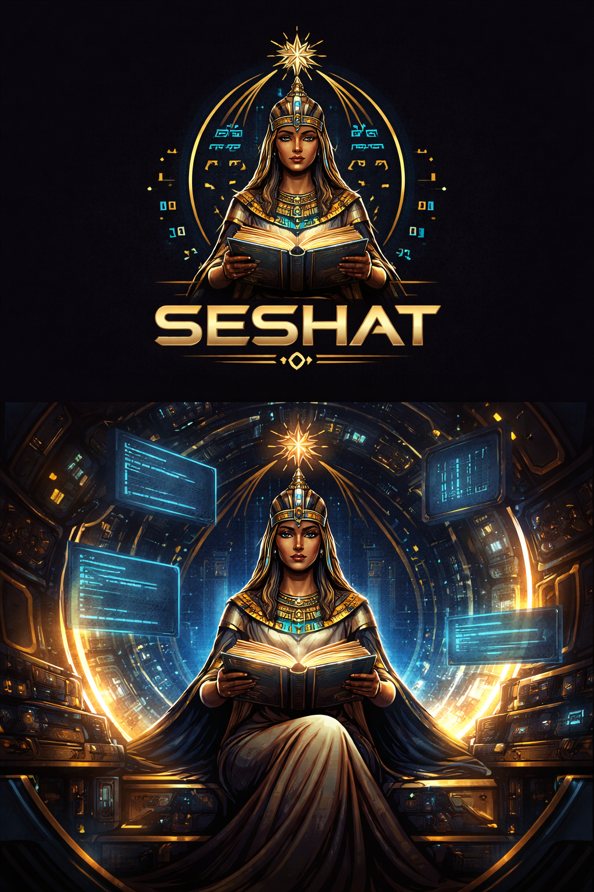

<p align="center">
  
</p>

<h1 align="center">Convention-aware project intelligence for AI coding agents</h1>

<p align="center">
  <a href="https://github.com/KSDaemon/seshat/actions/workflows/ci.yml"></a>
  <a href="https://crates.io/crates/seshat-bin"></a>
  <a href="LICENSE"></a>
  <a href="https://github.com/KSDaemon/seshat/stargazers"></a>
</p>

Seshat builds and maintains a per-project knowledge graph of
conventions, patterns, and architectural decisions, and exposes it to
AI agents via an MCP server. Agents query Seshat **before** writing
code, so generated changes match the project's existing style and
rules — not just whatever the model defaults to.

---

## The problem

Modern AI coding agents are powerful generators but terrible
historians. Every session starts from scratch: the same conventions
get re-explained, the same patterns get re-discovered, the same
"please don't use barrel imports here" gets repeated. Even with
careful prompting and planning modes, virtually every non-trivial
change touches the wrong helper, picks the wrong error style, or
duplicates code that already exists.

The cost is hidden but enormous — the time AI generation saves gets
spent in post-generation review and cleanup, and every inconsistency
that slips through makes the codebase a little harder for the *next*
AI-assisted change. Productivity gains plateau, and convention drift
compounds.

## What Seshat does

Seshat is a **shift-left intelligence layer**: it inspects your
project once, distills it into a queryable knowledge graph, and lets
your AI agent consult that graph instead of guessing. The graph has
three complementary layers:

- **Code intelligence** — AST-parsed modules, call graphs, and
  dependencies via tree-sitter (Rust, TypeScript, JavaScript, Python).
- **Convention detection** — 8 AST-level detectors infer how your
  team actually writes code (imports, error handling, naming,
  exports, logging, tests, file structure, dependency usage) with
  confidence scoring.
- **Explicit knowledge** — decisions, preferences, and
  architectural choices recorded over time, project-wide and
  merge-aware.

Delivered as a single Rust binary with embedded SQLite. No Docker, no
external services, no telemetry. Scan a repo, get a useful answer in
under five minutes.

## See it in action

A snapshot of how an agent's behaviour shifts once Seshat is
connected:

```text
# Without Seshat — generic LLM guess
You:    Add an "invalid args" error to the storage module.
Agent:  pub fn open() -> Result<Db, Box<dyn std::error::Error>> { ... }
        ↑ generic error type — but the project uses thiserror enums
          per crate with #[error("...")] on every variant.
```

```text
# With Seshat — agent consults the graph first
You:    Add an "invalid args" error to the storage module.
Agent:  → query_convention(topic="error handling")
        ← Convention: thiserror enum per crate, 92% adoption
          Example: crates/seshat-core/src/error.rs (CoreError)
        → query_code_pattern(query="StorageError")
        ← crates/seshat-storage/src/error.rs:14
Agent:  Adding StorageError::InvalidArgs { details: String }
        with #[error("invalid args: {details}")] to match the
        existing variants.
```

## Why Seshat

- **Shift-left, not shift-review** — convention guidance arrives at
  generation time, not as PR comments.
- **AST-level convention detection** — 8 detectors with confidence
  scoring, not regex frequency counts.
- **2D-typed knowledge graph** — every node has both a *nature*
  (fact, convention, observation, decision, preference) and a
  *weight* (rule, strong, moderate, weak, info). Conventions and
  explicit decisions live in the same graph.
- **Zero-config, local-first** — single binary, embedded SQLite, no
  SaaS, no data leaves your machine.
- **Merge-aware decisions** — a decision approved on a feature
  branch survives the merge into `main` and never re-surfaces on
  re-scan.

## How it compares

We surveyed the adjacent code-intelligence MCP servers. None of the
others do automated convention inference; most focus on either
structural graphs or semantic search.

| Project | Convention detection | Knowledge graph | AST languages | Single binary | Stack |
|---|---|---|---|---|---|
| **Seshat** | ✅ 8 AST detectors, confidence-scored | ✅ 2D-typed (Nature × Weight) | 4 (Rust, TS, JS, Py) | ✅ | Rust |
| codebase-context | ⚠️ frequency/regex only | ❌ flat JSON | 10 | ❌ | Node.js |
| codebase-memory-mcp | ❌ | ✅ labeled property graph + Cypher | 66 | ✅ | C |
| axon | ❌ | ✅ KuzuDB + Leiden clustering | 3 | ❌ | Python |
| megamemory | ❌ (LLM-as-indexer) | ✅ concept-level | ❌ | ❌ | Node.js |
| socraticode | ❌ | ❌ (vector only) | 18 | ❌ (Docker) | Node.js |
| octocode-mcp | ⚠️ code-smell scanner | ❌ (LSP + ripgrep) | n/a (LSP) | ❌ | Node.js |

Convention detection is the column where Seshat is unique — every
other tool focuses on either structural graphs or semantic search,
none of them auto-infer how your team actually writes code. Full
write-up: [Competitive analysis](docs/research/competitive-analysis-2026-03-30.md).

## Install

```bash
curl -fsSL https://raw.githubusercontent.com/KSDaemon/seshat/main/install.sh | sh
```

Or from source:

```bash
cargo install --path crates/seshat-bin
```

## Quick start

```bash
seshat init              # 1. register Seshat with your AI client(s) — once per machine
seshat scan              # 2. build the knowledge graph for the current project
seshat review            # 3. (optional) triage auto-detected conventions in a TUI
```

That's it. After `init`, your AI client (Claude Code, Cursor,
opencode, Claude Desktop) launches the MCP server on demand —
**you never run `seshat serve` by hand**. The agent starts calling
Seshat tools as soon as it touches your project; the server auto-syncs
on git HEAD changes, so a `git pull` or branch switch doesn't require
a manual rescan.

In non-git directories, freshness checks are skipped silently and
Seshat operates as a single-branch project named `main`.

## How it works

**Scan** — tree-sitter AST parsing produces an intermediate
representation; 8 detectors emit convention findings with confidence
scores; everything is persisted to SQLite.

**Serve** — long-lived MCP server speaking stdio, exposing nine
tools. Auto-syncs on git HEAD changes.

**Review** — TUI for triaging auto-detected conventions. Decisions
are stored project-wide and survive merges.

### MCP tools

| Tool | Purpose |
|---|---|
| `query_project_context` | Stack, modules, dependencies, golden files |
| `query_convention` | "How is X done in this project?" |
| `query_code_pattern` | Real code examples with call-site evidence |
| `query_dependencies` | Impact / blast radius for a file or symbol |
| `validate_approach` | Graduated pre-flight check before edits |
| `map_diff_impact` | Pre-commit analysis of uncommitted changes |
| `record_decision` / `update_decision` / `remove_decision` | Manage explicit decisions |

## CLI overview

Roughly in the order you'll use them:

| Command | Purpose |
|---|---|
| `seshat init` | Register Seshat with your AI client(s) — run once per machine |
| `seshat scan [path]` | Build (or update) the knowledge graph for a project |
| `seshat review` | Interactive TUI to triage auto-detected conventions |
| `seshat status` | Show indexed projects, submodules, and DB info |
| `seshat serve [path]` | MCP server entry point — **auto-invoked by AI clients**, you rarely run it manually |
| `seshat decisions <subcommand>` | List / forget / export / import project-wide decisions |
| `seshat completions [SHELL]` | Print shell completion scripts |
| `seshat update` | Self-update to the latest release |
| `seshat uninstall` | Reverse `init` — remove Seshat configuration from AI clients |

Full per-command reference with every flag and example lives in
[`docs/cli.md`](docs/cli.md). Run `seshat <command> --help` for
inline help.

## Configuration

Copy `seshat.example.toml` to `seshat.toml` (project-local) or
`$XDG_CONFIG_HOME/seshat/seshat.toml` (user-global). Every key has a
default, so an empty file is valid.

## Supported platforms

Pre-built binaries are published with every release on the
[GitHub Releases](https://github.com/KSDaemon/seshat/releases) page:

| Platform | Target triple |
|---|---|
| Linux x86_64 | `x86_64-unknown-linux-gnu` |
| Linux ARM64 | `aarch64-unknown-linux-gnu` |
| macOS Apple Silicon (M1/M2/M3/...) | `aarch64-apple-darwin` |
| Windows x86_64 | `x86_64-pc-windows-msvc` |

### Not currently shipped

**Intel Mac (`x86_64-apple-darwin`)** — Seshat depends on `fastembed`
for local embeddings, which transitively pulls in
[`ort`](https://crates.io/crates/ort) (ONNX Runtime). Upstream `ort`
no longer ships prebuilt binaries for Intel macOS, and building ONNX
Runtime from source in our CI pipeline is not currently viable.
Apple Silicon Macs are fully supported.

If you need Seshat on a platform we don't pre-build for, building from
source with `cargo install --path crates/seshat-bin` works for most
pure-Rust environments — Intel Mac is the exception noted above.

## Status & roadmap

**Today:** 4 supported languages (Rust, TypeScript, JavaScript,
Python), 8 convention detectors (dependency usage, import
organization, error handling, naming, exports, logging, tests, file
structure), a 9-tool MCP surface, project-wide merge-aware decisions,
and a TUI review wizard. The product is in daily use as the
operating manual for its own codebase.

**Next:** multi-project daemon mode with HTTP/SSE transports,
Windows self-update parity, the Homebrew tap, more languages (Go and
Java are the most-requested), and additional detectors. Full plan
and priorities: [`roadmap.md`](_bmad-output/planning-artifacts/roadmap.md).

## Contributing

Your contributions are highly welcomed! Bug reports, feature requests,
documentation improvements, and code changes are all appreciated:

- Open an issue or PR on [GitHub](https://github.com/KSDaemon/seshat).
- For non-trivial changes, please start with an issue to discuss the
  approach before sending a PR — it saves us both time.
- Help expanding platform support (e.g. building `ort` from source for
  Intel Mac, or adding new architectures) is especially welcome.

## License

MIT — see [`LICENSE`](LICENSE).
